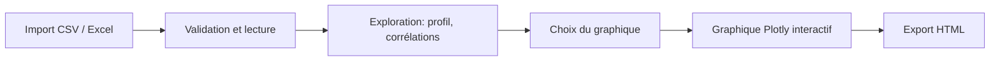

<div align="center">

# GraphGen

**Transformez un fichier CSV ou Excel en analyse exploratoire et en graphiques interactifs, sans écrire une ligne de code.**

[](https://github.com/Chaymae-El-Bahloul/GraphGen/actions)


[Démo en ligne](#) · [Installation](#démarrage-rapide) · [Fonctionnalités](#fonctionnalités)

</div>

<!-- Ajouter une capture d'écran:  -->

## Pourquoi GraphGen ?

Explorer un fichier de données demande souvent du code ou un outil lourd. **GraphGen** permet à n'importe qui d'importer un fichier, de comprendre sa qualité (valeurs manquantes, doublons, corrélations) et de produire des graphiques interactifs en quelques clics.

## Fonctionnalités

| | |
|---|---|
| **Import** | `.csv` et `.xlsx` multi-feuilles (10 Mo max), glisser-déposer, jeu de données de démonstration intégré |
| **Détection automatique** | Séparateur CSV, encodage, et **ligne d'en-tête Excel** (ignore les lignes de titre) |
| **Exploration** | Indicateurs clés (lignes, colonnes, % de manquants, doublons), **profil de chaque colonne**, **matrice de corrélation** |
| **Visualisation** | 6 types de graphiques: ligne, barres, nuage de points, histogramme, boîte à moustaches, camembert |
| **Agrégations** | Somme, moyenne, nombre, minimum, maximum, avec regroupement par couleur |
| **Personnalisation** | 5 palettes, titre libre, **export HTML interactif** |
| **Interface** | Responsive, mode sombre automatique |

## Comment ça marche



## Stack technique

| Couche | Technologies |
|---|---|
| Backend | Python, Flask, Gunicorn |
| Données | pandas, openpyxl |
| Visualisation | Plotly |
| Frontend | Jinja2, HTML, CSS (thème clair / sombre) |
| Qualité | pytest, ruff, GitHub Actions |
| Déploiement | Docker, Procfile (Render / Railway) |

## Démarrage rapide

```bash
git clone https://github.com/Chaymae-El-Bahloul/GraphGen.git
cd GraphGen
python -m venv .venv
.venv\Scripts\activate          # Linux / Mac: source .venv/bin/activate
pip install -r requirements.txt
python app.py
```

Ouvrir <http://127.0.0.1:5000>, puis cliquer sur **« Essayer avec un jeu de données de démo »**.

### Docker

```bash
docker build -t graphgen .
docker run -p 8000:8000 -e SECRET_KEY=change-me graphgen
```

## Qualité et sécurité

- Fichiers stockés sous **identifiant aléatoire** (pas de path traversal), extensions validées, taille limitée
- **Suppression automatique** des fichiers importés après 24 h
- En-têtes de sécurité HTTP, route de santé `/health`, logs structurés
- **12 tests**`pytest`, linter `ruff`, intégration continue GitHub Actions
- Conteneur Docker non-root avec healthcheck

```bash
pip install -r requirements-dev.txt
ruff check .
pytest
```

## Architecture

```
GraphGen/
├── app.py              # Routes Flask, sécurité, configuration
├── helpers.py          # Chargement, profilage, corrélations, graphiques
├── templates/          # Pages Jinja2: base, index, preview, chart
├── static/style.css    # Thème clair / sombre, responsive
├── sample_data/        # Jeu de démonstration synthétique
├── tests/              # Tests pytest
├── Dockerfile · Procfile · pyproject.toml
└── .github/workflows/ci.yml
```

## Configuration

| Variable | Rôle | Défaut |
|---|---|---|
| `SECRET_KEY` | Clé de session Flask (**à définir en production**) | valeur de développement |
| `UPLOAD_TTL_HOURS` | Durée de conservation des fichiers importés | `24` |
| `FLASK_DEBUG` | `1` pour activer le mode debug en local | désactivé |

## Déploiement

Sur Render ou Railway: commande de build `pip install -r requirements.txt`, commande de démarrage `gunicorn "app:create_app()"` (voir `Procfile`), puis définir la variable `SECRET_KEY`.

## Feuille de route

- [x] Import CSV / Excel multi-feuilles
- [x] Profilage des colonnes et corrélations
- [x] 6 types de graphiques, agrégations, export HTML
- [x] Tests, CI, Docker
- [ ] Export PNG
- [ ] Filtres sur les données
- [ ] Graphiques multi-séries
- [ ] Authentification

## Auteures

Projet réalisé par :

- **Chaymae El Bahloul**: [GitHub](https://github.com/Chaymae-El-Bahloul) · [LinkedIn](https://www.linkedin.com/in/chaymae-el-bahloul)
- **Samah Boudallaa**: [GitHub](https://github.com/Samah-boudallaa) [LinkedIn]([LinkedIn](www.linkedin.com/in/samah-boudallaa-92409a329)

Étudiantes en Data Science.

## Licence

Distribué sous licence MIT. Voir le fichier [LICENSE](LICENSE).
